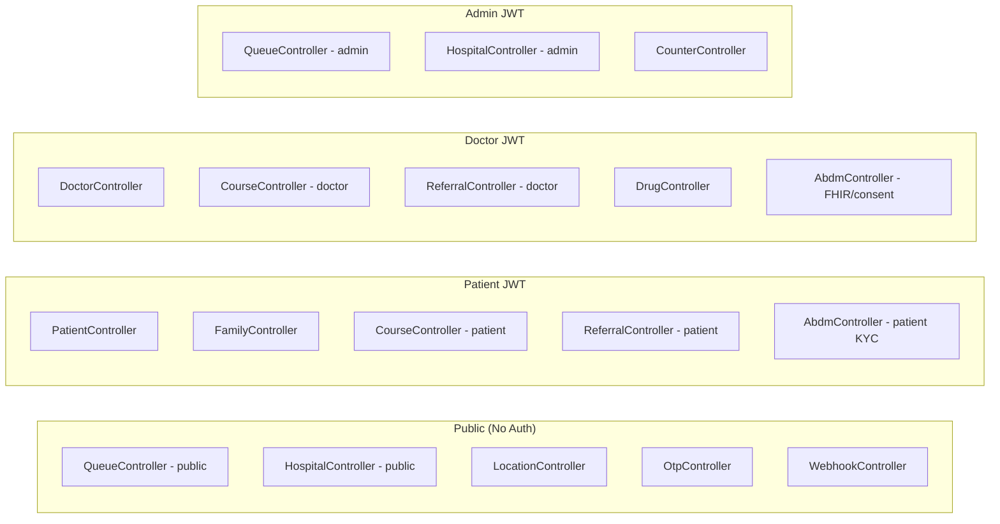

# ArogyaFlow — Complete Frontend Architecture from Backend API Map

> **Premise**: Every screen and flow below is derived directly from the available backend APIs (14 controllers, 27 services, 51 DTOs). Nothing is invented — if a screen exists here, the backend already supports it. The UI design language follows the Stitch reference: **clean blue palette, card-based layouts, WhatsApp-web-view-style for patient mobile, dark sidebar for admin/doctor desktop**.

---

## Design Language Reference (from Stitch Screens)

| Surface | Design Pattern Observed |
|---------|------------------------|
| **Patient Mobile** (Sarathi/PM-JAY screens) | Minimal white cards, single-column stacked list items with icon + title + subtitle, full-width teal/green CTA at bottom, thin top bar with ← back + title + ⋮, radio/accordion selectors |
| **Admin Desktop** (OPDX screens) | Dark navy sidebar with icon+label nav, light main content area, stat cards row (Total/Active/Break/Offline as colored badge cards), filterable data tables with pagination, modal forms for create/edit |
| **Doctor Desktop** (Doctor Mgmt screen) | Same dark sidebar, stat card row, table with status badges (Active/On Break/Offline as colored pills), action icons (edit/view/delete) per row |
| **Forms** (Add Receptionist screen) | Centered modal on blurred backdrop, labeled fields with subtle borders, counter stepper UI for numbers, pill-toggle for shifts (Morning/Evening/Night), primary CTA at bottom-right |

---

## Complete Backend API → Frontend Screen Map

### 14 Backend Controllers & Their Frontend Coverage



---

## PART 1: PATIENT FLOWS (WhatsApp Web View Style)

> **Key principle**: The patient accesses the web app primarily through WhatsApp links. The UI must work as an embedded web view inside WhatsApp — meaning: **no sidebar, no complex navigation, single-column, card-stacked, minimal chrome, fast load**.

### Flow A: Entry Point — "What do you want to do?"

**Screen: `/` (Landing / Service Menu)**
- Inspired by: Sarathi Service Menu (single-column icon+label list)
- NOT a marketing homepage — a **service selector**

```
┌──────────────────────────────┐
│ ← ArogyaFlow           ⋮    │  ← thin header, no hero
│──────────────────────────────│
│                              │
│  What would you like to do?  │
│                              │
│  ┌────────────────────────┐  │
│  │ 🎟️ Book OPD Token      │  │  → /find-hospital
│  │    Join queue at a     │  │
│  │    hospital near you   │  │
│  └────────────────────────┘  │
│  ┌────────────────────────┐  │
│  │ 🔍 Track My Turn       │  │  → /track
│  │    Check live queue    │  │
│  │    position            │  │
│  └────────────────────────┘  │
│  ┌────────────────────────┐  │
│  │ 📋 My Health Records   │  │  → /login/patient
│  │    Prescriptions,      │  │
│  │    reports, referrals  │  │
│  └────────────────────────┘  │
│  ┌────────────────────────┐  │
│  │ 🏥 Find Hospitals      │  │  → /find-hospital
│  │    Nearby OPDs with    │  │
│  │    live queue status   │  │
│  └────────────────────────┘  │
│  ┌────────────────────────┐  │
│  │ 👤 Family & ABHA       │  │  → /login/patient → /patient/family
│  │    Manage family,      │  │
│  │    link Ayushman card  │  │
│  └────────────────────────┘  │
│                              │
│  ─── For Healthcare Staff ───│
│  👨‍⚕️ Doctor Portal  🏥 Staff │  → small text links
│                              │
│  ┌────────────────────────┐  │
│  │    Continue →           │  │  ← full-width CTA (green)
│  └────────────────────────┘  │
│                              │
│  ⊙ Powered by ArogyaFlow    │
└──────────────────────────────┘
```

**APIs used**: None (pure navigation)

---

### Flow B: Find Hospital → Book Token (Multi-Hospital)

**Screen B1: `/find-hospital` — Share Location + Choose Hospital**

```
Step 1: Location Capture (mandatory)
├── Auto-trigger geolocation on page load
├── If granted → fetch GET /api/hospitals/nearby?lat=&lon=&limit=20
├── If denied → show manual search via GET /api/hospitals (full list, alphabetical)
│   └── Show: "📍 Location sharing helps find nearest hospitals. Enable in settings."
└── Location denied does NOT block — user can still browse and select

Step 2: Hospital List (card-per-hospital, sorted by distance)
├── Each card shows:
│   ├── #rank Hospital Name          🟢 OPD Open / 🔴 Closed
│   ├── 📍 Address · 📏 ~X.X km away
│   ├── ⏰ OPD: 09:00 – 17:00
│   ├── Category pills: [General] [Pediatrics] [Cardiology]
│   └── [Book Here →] button
├── Department filter dropdown (GET /api/hospitals/categories)
├── Previous / Page N / Next pagination (offset/limit=20)
└── Each "Book Here" → /book?hospitalId=X&hospitalName=Y
```

**APIs used**:
- `GET /api/hospitals/nearby` (with coords) OR `GET /api/hospitals` (without coords)
- `GET /api/hospitals/categories`

**Screen B2: `/book` — Book OPD Token**

```
Flow Order (top to bottom, single page):

1. Hospital Banner (pre-filled from URL params)
   └── "🏥 Booking at City Hospital · Change hospital"

2. Phone Number (FIRST — this is identity)
   ├── type="tel" inputMode="numeric" autoComplete="tel"
   ├── Auto-prepend +91 if missing
   └── If patient JWT already exists → pre-fill, skip OTP

3. OTP Verification (inline, not a separate page)
   ├── Auto-send OTP on phone blur/submit (POST /api/auth/otp/send)
   ├── 6-digit input with inputMode="numeric", auto-focus
   ├── WebOTP API: navigator.credentials.get({otp}) for auto-read
   ├── 30s resend countdown timer
   └── POST /api/auth/otp/verify → stores PATIENT JWT

4. Patient Details
   ├── Full Name (text, autocapitalize="words")
   ├── Age (number, inputMode="numeric", pattern="[0-9]*")
   └── Gender (3 pill-tap-targets: Male / Female / Other — NOT a dropdown)

5. Department (CONDITIONAL — only if hospital has >1 department)
   ├── GET /api/hospitals/{slug}/departments
   ├── If 1 department → auto-select, don't show this field
   └── If >1 → radio buttons (not dropdown), showing department names

6. Location Capture (mandatory, with fallback)
   ├── "📍 Share My Location" button
   ├── Auto-trigger geolocation
   ├── If denied:
   │   ├── Show DIGIPIN manual entry (POST /api/location/digipin/decode)
   │   ├── OR manual lat/lon entry
   │   └── "Your location helps estimate wait time. Without it, 
   │        we can't send 'leave now' alerts."
   └── If captured → show "✓ Location captured (±Xm accuracy)"

7. Pre-submission Preview
   └── "You'll be Token #~XX · Estimated wait: ~YY min"
       (from GET /api/queue?hospitalId=X → stats.waiting count × avgServiceMinutes)

8. Submit → POST /api/queue
   └── On success → navigate to /token/:id
```

**APIs used**:
- `POST /api/auth/otp/send`, `POST /api/auth/otp/verify`
- `GET /api/hospitals/{slug}/departments`
- `GET /api/hospitals/categories`
- `POST /api/location/digipin/decode` (fallback)
- `GET /api/queue` (for wait estimate preview)
- `POST /api/queue` (booking)
- `GET /api/queue/closing-time-check` (optional pre-check)

---

### Flow C: Track Token / Live Queue Position

**Screen C1: `/track` — Lookup**
```
├── If patient JWT exists → auto-lookup via GET /api/queue/position/{phone}
├── If no JWT → phone input form
├── Remember last phone in localStorage
└── On found → redirect to /token/:id
    On not found → "No active token. Book one?" → /find-hospital
```

**Screen C2: `/token/:id` — Live Token Dashboard**
```
Auto-polls GET /api/queue/token/:id every 8 seconds

┌──────────────────────────────┐
│ ← Back                      │
│──────────────────────────────│
│                              │
│  ┌────────────────────────┐  │
│  │ ✅ Registration Confirmed│  │
│  │ 🏛️ Hospital: City Hosp  │  │
│  │ 📅 Date: 18 Sep 2026    │  │
│  │ 🎟️ Token: #7            │  │
│  │ 👤 Patient: Ram Kumar   │  │
│  │ 🏥 Dept: General        │  │
│  │ Status: ⏳ Waiting      │  │
│  └────────────────────────┘  │
│                              │
│  ┌────  Queue Position  ────┐│
│  │  Position 4 in queue     ││
│  │  3 people ahead of you   ││
│  │  Now serving: #4         ││
│  └──────────────────────────┘│
│                              │
│  ┌──── Time Estimates ──────┐│
│  │ 🚗 Your travel ETA: 12 min│
│  │ ⏱️ Estimated wait: 28 min│
│  │ ⚠️ Arrive by: 10:45 AM   │ ← anomalyControlUntil
│  └──────────────────────────┘│
│                              │
│  [📍 Update My Location]     │  → POST /api/queue/:id/location
│  [🕐 Will I make it?]        │  → GET /api/queue/closing-time-check
│                              │
│  ┌──── Feasibility ─────────┐│ (shown after "Will I make it?")
│  │ ✅ You're on track —     ││
│  │ ~12 min away, 45 min     ││
│  │ left before closing      ││
│  └──────────────────────────┘│
│                              │
│       ┌──────────┐           │
│       │ QR Code  │           │
│       │ (200×200)│           │
│       └──────────┘           │
│  Show this QR to staff       │
│  when called                 │
└──────────────────────────────┘
```

**APIs used**:
- `GET /api/queue/token/:id` (polling)
- `GET /api/queue/qr/:id` (QR image)
- `POST /api/queue/:id/location`
- `GET /api/queue/closing-time-check`

---

### Flow D: Patient Portal (Authenticated)

**Entry**: Phone+OTP login → `POST /api/auth/otp/verify` → PATIENT JWT

**Screen D0: `/patient` — My Queue (home)**
```
├── Auto-check: GET /api/queue/position/{phone}
├── If active token → show TokenCard (same as /token/:id)
├── If no token → show BookForm
│   ├── Family member quick-select (GET /api/family/members)
│   ├── Name, Age, Gender, Department, Location
│   └── POST /api/queue
└── Polls every 8s
```

**Screen D1: `/patient/family` — Family Unit & ABHA**
```
Section 1: Family Overview
├── GET /api/family → FamilyUnitDto (head name, member count, ABHA count)
├── GET /api/family/members → FamilyMemberDto[]
└── Each member card:
    ├── Name · Relationship · Age · Gender
    ├── ABHA Status: ✅ Verified / ❌ Not linked
    ├── [Quick Book] → /book?name=X&age=Y&gender=Z (pre-fills)
    └── [Link ABHA] → ABHA KYC modal

Section 2: Add Family Member
├── Modal: Name, Relationship, Age, Gender
└── POST /api/family/members

Section 3: ABDM M1 — Ayushman Bharat KYC
├── ABDM Gateway status: GET /api/abdm/status
│   └── Shows: M1 e-KYC ✅ | M2 Care Contexts ✅ | M3 Consent ✅
├── KYC Methods (tabs):
│   ├── Tab 1: Aadhaar OTP
│   │   └── POST /api/abdm/kyc/init {type:"aadhaar", value:"XXXXXXXXXXXX"}
│   │   └── POST /api/abdm/kyc/verify {txnId, otp}
│   ├── Tab 2: ABHA Number OTP
│   │   └── POST /api/abdm/kyc/init {type:"abha-number", value:"XX-XXXX-XXXX-XXXX"}
│   └── Tab 3: Direct ABHA Address
│       └── GET /api/abdm/check-address?abhaAddress=name@abdm
│       └── POST /api/family/members/{id}/link-abha
└── ABHA Health Card Modal (print-ready Government of India card)
```

**APIs used**:
- `GET /api/family`, `GET /api/family/members`, `POST /api/family/members`
- `POST /api/family/members/{id}/link-abha`
- `GET /api/abdm/status`, `POST /api/abdm/kyc/init`, `POST /api/abdm/kyc/verify`
- `GET /api/abdm/check-address`

**Screen D2: `/patient/records` — Unified Records Hub** (consolidates 4 current pages)
```
Tab 1: Prescriptions & Reports (Documents)
├── GET /api/patients/documents → PatientDocumentDto[]
├── Upload: POST /api/patients/documents (multipart)
├── View: GET /api/patients/documents/{id}/file (authed blob)
└── Each doc: type badge (Rx/Report), date, hospital, patient name

Tab 2: Care Episodes
├── GET /api/courses/patient → CourseDto[]
├── Each episode card: department, doctor, diagnosis, status, date
├── Expand → GET /api/courses/{id}/timeline
│   └── Shows: encounters, clinical notes, prescriptions, documents
└── Document download: GET /api/courses/{id}/documents/{docId}/download

Tab 3: Referral Slips
├── GET /api/referrals/patient → ReferralDto[]
├── Each slip: from hospital → to hospital, department, priority tier
│   ├── 🚨 Emergency (24h) | ⚡ Urgent (7-day) | 📋 Routine (30-day)
│   ├── Status: pending/completed/cancelled/expired
│   └── Valid until: date
└── View QR Slip: GET /api/referrals/{id}/qr (admission pass)

Tab 4: Visit History
├── GET /api/patients/history → TokenHistoryDto[]
└── Table: visit ID, name, age, department, served at, completed at
```

**Screen D3: `/patient/access` — Doctor Access & Privacy**
```
Section 1: Grant Access
├── Enter 8-char code OR scan QR via camera
├── POST /api/patients/access/{code}/accept
└── Instant WhatsApp notification with revoke command

Section 2: Active Grants
├── GET /api/patients/access → AccessGrantDto[]
├── Each: doctor name, hospital, granted date
└── [🚫 Revoke] → POST /api/patients/access/{id}/revoke

Section 3: Audit History
├── GET /api/patients/access/history → AccessGrantDto[] (includes revoked)
└── Shows granted/revoked timestamps
```

---

## PART 2: DOCTOR FLOWS (Desktop-First, Dark Sidebar)

> **Layout**: OPDX-style dark navy sidebar with icon+label navigation. Top bar with hospital name, live sync status, system latency. Main content area with cards.

### Sidebar Navigation (6 items)
```
┌──────────────────┐
│ 🩺 ArogyaFlow    │
│ Doctor Portal     │
│──────────────────│
│ 👤 Profile       │  → /doctor
│ 💊 Consultation  │  → /doctor/consultation
│ 📋 Care Episodes │  → /doctor/courses
│ 🔄 Referrals     │  → /doctor/referrals
│ 👥 My Patients   │  → /doctor/patients
│ 🔑 Request Access│  → /doctor/access
│──────────────────│
│ Dr. Rajesh Kumar │
│ City Hospital    │
│ [Log out]        │
└──────────────────┘
```

### Flow E: Doctor Onboarding

**Screen E1: `/login/doctor` — Phone+OTP Login**
```
Step 1: Phone → POST /api/auth/otp/send
Step 2: OTP → POST /api/auth/otp/verify
Step 3: Auto-detect:
├── Try POST /api/doctors/login → if success → DOCTOR JWT → /doctor
└── If fails (no account) → show name field
    └── POST /api/doctors/register → DOCTOR JWT → /doctor
```

**Screen E2: `/doctor` — Profile & Hospital Link**
```
Section 1: Profile Card
├── GET /api/doctors/me → DoctorDto
├── Shows: Doctor ID, Phone, Hospital (if linked), Counter, Department
└── If no hospital → "Join a hospital" form

Section 2: Join Hospital
├── Input: 8-char hospital join code
└── POST /api/doctors/join-hospital

Section 3: My OPD Schedule
├── GET /api/doctors/me/time-slots → TimeSlotDto[]
└── Table: date, start-end time, department
```

### Flow F: Consultation Room (The Core Doctor Experience)

**Screen F1: `/doctor/consultation` — Live OPD Console**

This is the most complex screen, inspired by the OPDX Patient Flow desktop layout:

```
┌─────────────────────────────────────────────────────────┐
│ HEADER: Live Counter Status                              │
│ ┌──────────┐ ┌──────────┐ ┌──────────┐ ┌──────────┐    │
│ │ In Chair  │ │ Waiting  │ │ Completed│ │ Missed   │    │
│ │ Token #7  │ │    12    │ │    34    │ │    2     │    │
│ └──────────┘ └──────────┘ └──────────┘ └──────────┘    │
│ Auto-polls: GET /api/queue/current + GET /api/queue      │
├─────────────────────────────────────────────────────────┤
│ PATIENT IN CHAIR: Ram Kumar · Age 45 · Male              │
│ Token #7 · General Medicine · Counter #2                 │
├─────────────────────────────────────────────────────────┤
│                                                          │
│ Chief Complaint *                                        │
│ ┌──────────────────────────────────────────────────┐    │
│ │ Fever and body pain since 3 days                  │    │
│ └──────────────────────────────────────────────────┘    │
│                                                          │
│ Clinical Notes               Examination Findings        │
│ ┌────────────────────┐      ┌────────────────────┐      │
│ │                    │      │                    │      │
│ └────────────────────┘      └────────────────────┘      │
│                                                          │
│ Care Plan                                                │
│ ┌──────────────────────────────────────────────────┐    │
│ │                                                    │    │
│ └──────────────────────────────────────────────────┘    │
│                                                          │
│ ── Prescriptions (Rx) ──────────────────────────────    │
│ Drug Search: [____________🔍]  (GET /api/drugs/search)   │
│ ┌────────┬─────────┬─────────┬──────┬─────────────┐    │
│ │ Drug   │ Dosage  │ Freq    │ Days │ Instructions │    │
│ ├────────┼─────────┼─────────┼──────┼─────────────┤    │
│ │ Parace │ 500mg   │ TID     │ 5    │ After food  │    │
│ │ Amoxi  │ 250mg   │ BD      │ 7    │ Before food │    │
│ └────────┴─────────┴─────────┴──────┴─────────────┘    │
│ + Add Rx Row                                             │
│                                                          │
│ Drug search: Eka Care Live Registry                      │
│ ├── Autocomplete with debounce (250ms)                   │
│ ├── Shows NLEM badge, formulation, strength              │
│ └── GET /api/drugs/templates for dosage presets           │
│                                                          │
│ ── Lab Investigations ──────────────────────────────    │
│ Lab Search: [____________🔍]  (GET /api/drugs/labs)      │
│ Quick presets: [CBC] [FBS] [Lipid] [LFT] [AFB] [Urine] │
│ Selected: CBC, FBS                                       │
│                                                          │
│ ── Optional Referral ───────────────────────────────    │
│ ☐ Issue Referral to Another Hospital                     │
│   If checked:                                            │
│   ├── Target Hospital (GET /api/hospitals) with quota    │
│   ├── Department dropdown                                │
│   ├── Priority: (Emergency) (Urgent) (Routine)          │
│   ├── Reason text                                        │
│   └── Shows remaining quota for selected hospital        │
│                                                          │
│ ┌──────────────────────────────────────────────────┐    │
│ │  ✅ Complete Consultation & Call Next Patient      │    │
│ └──────────────────────────────────────────────────┘    │
│ POST /api/courses/{id}/complete-and-next                 │
│ Atomically:                                              │
│ ├── Creates encounter with Rx + labs + notes             │
│ ├── Advances queue (token → completed, next → serving)   │
│ ├── Sends WhatsApp summary to patient                    │
│ ├── Creates ABDM M2 Care Context                        │
│ ├── Generates FHIR R4 OPConsultRecord bundle             │
│ └── If referral → creates referral with quota lock       │
│                                                          │
│ POST-COMPLETION MODAL:                                   │
│ ├── "✅ Consultation complete. Next patient called."     │
│ ├── If referral: [View Referral QR Pass]                │
│ └── [Inspect FHIR R4 Bundle (JSON)]                     │
│     └── GET /api/abdm/courses/{cid}/encounters/{eid}/fhir│
└─────────────────────────────────────────────────────────┘
```

**APIs used (this single screen)**:
- `GET /api/doctors/me`
- `GET /api/queue` (stats), `GET /api/queue/current` (active patient)
- `GET /api/drugs/search`, `GET /api/drugs/labs`, `GET /api/drugs/templates`
- `GET /api/hospitals` (for referral target selection)
- `POST /api/courses` (create course for patient)
- `POST /api/courses/{id}/complete-and-next` (atomic completion)
- `POST /api/referrals` (if referral enabled)
- `GET /api/abdm/courses/{cid}/encounters/{eid}/fhir` (FHIR inspection)

### Flow G: Care Episodes & Documents

**Screen G1: `/doctor/courses` — EMR Browser**
```
├── Search by Course ID input
├── GET /api/courses/{id} → header (patient, dept, diagnosis, status)
├── GET /api/courses/{id}/timeline → encounters timeline
│   └── Each encounter: date, doctor, notes, exam, plan, Rx list
├── Document vault:
│   ├── GET /api/courses/{id}/documents/{docId}/download
│   └── POST /api/courses/{id}/documents (upload)
├── Add follow-up encounter: POST /api/courses/{id}/encounters
├── ABDM Consent Bundle: GET /api/courses/{id}/consent-bundle
└── Close episode: POST /api/courses/{id}/close
```

### Flow H: Referrals & Triage

**Screen H1: `/doctor/referrals`**
```
Section 1: Issue New Referral
├── Course ID selection
├── Target hospital + department + priority tier
├── GET /api/referrals/prior-context (incoming referral context)
├── POST /api/referrals (with quota locking)
└── POST completion: View QR Pass → GET /api/referrals/{id}/qr

Section 2: Incoming Referral Reception
├── Enter course ID or scan QR
├── GET /api/referrals/prior-context?courseId=&toHospitalId=
│   └── Shows: originating clinic, referring doctor, priority, reason
├── [Admit & Complete] → POST /api/referrals/{id}/complete
└── [Cancel / Reject] → POST /api/referrals/{id}/cancel
```

### Flow I: Patient Access

**Screen I1: `/doctor/access` — Consent QR Generator**
```
├── POST /api/doctors/access-requests → generates 8-char code, 30-min TTL
├── GET /api/doctors/access-requests/{code}/qr → scannable PNG
├── Code display with copy-to-clipboard
└── Active patients count: GET /api/doctors/patients

Screen I2: /doctor/patients — Authorized Patient Records
├── GET /api/doctors/patients → grouped by (name, age)
├── Each patient group:
│   ├── Documents list (prescriptions, reports)
│   ├── View: GET /api/doctors/patients/documents/{docId}/file
│   └── Upload: POST /api/doctors/patients/documents/upload
└── Access is revocable by patient at any time
```

---

## PART 3: ADMIN / HOSPITAL STAFF FLOWS (Desktop, Dark Sidebar)

> **Layout**: OPDX Receptionist Management style — dark sidebar, stat cards, tables with filters, modal forms.

### Sidebar Navigation (5 items)
```
┌──────────────────┐
│ 🏥 ArogyaFlow    │
│ Staff Console     │
│──────────────────│
│ 📊 Live Queue    │  → /admin
│ 🔢 Counters      │  → /admin/counters
│ ❌ Missed Queue  │  → /admin/missed
│ 📜 Visit History │  → /admin/history
│ 🏛️ Hospitals     │  → /admin/hospitals
│──────────────────│
│ admin@hospital   │
│ [Log out]        │
└──────────────────┘
```

### Flow J: Admin Login

**Screen J1: `/login/admin`**
```
├── Username + Password form
├── POST /api/queue/login → ADMIN JWT
└── Redirect to /admin
```

### Flow K: Live Queue Management

**Screen K1: `/admin` — Live Queue Console**

Inspired by OPDX Receptionist Management:

```
┌─────────────────────────────────────────────────────────┐
│ FILTERS ROW                                              │
│ Hospital: [All ▾]  Department: [All ▾]                  │
│ (GET /api/hospitals, GET /api/hospitals/categories)      │
├─────────────────────────────────────────────────────────┤
│ STAT CARDS (like OPDX: 4 colored cards in a row)        │
│ ┌────────┐ ┌────────┐ ┌────────┐ ┌────────┐ ┌────────┐│
│ │ Total  │ │Waiting │ │Serving │ │Complete│ │ Missed ││
│ │  45    │ │  12    │ │   3    │ │  28    │ │   2    ││
│ │ (gray) │ │(amber) │ │ (blue) │ │(green) │ │ (red)  ││
│ └────────┘ └────────┘ └────────┘ └────────┘ └────────┘│
├─────────────────────────────────────────────────────────┤
│ VERIFY PATIENT                                           │
│ [Token ID ____] [Verify ✓]  [📷 Scan QR]               │
│ POST /api/queue/verify                                   │
├─────────────────────────────────────────────────────────┤
│ QUEUE TABLE (auto-refreshes every 10s)                   │
│ GET /api/queue                                           │
│ ┌────┬──────────┬────────────┬────────┬────────┬───────┐│
│ │ ID │ Name     │ Department │ Status │ Time   │Actions││
│ ├────┼──────────┼────────────┼────────┼────────┼───────┤│
│ │ #7 │ Ram      │ General    │⏳ Wait │ 09:12  │[Call] ││
│ │    │          │            │        │        │[Skip] ││
│ │    │          │            │        │        │[Miss] ││
│ ├────┼──────────┼────────────┼────────┼────────┼───────┤│
│ │ #4 │ Sita     │ General    │🔵 Serv │ 09:05  │[Done] ││
│ └────┴──────────┴────────────┴────────┴────────┴───────┘│
│                                                          │
│ Actions:                                                 │
│ ├── Call → PUT /api/queue/:id {status:"serving"}        │
│ ├── Skip → POST /api/queue/:id/no-show                  │
│ ├── Miss → PUT /api/queue/:id {status:"missed"}         │
│ └── Done → PUT /api/queue/:id {status:"completed"}      │
├─────────────────────────────────────────────────────────┤
│ ANOMALY CONTROL (if any)                                 │
│ GET /api/queue/anomaly-control                           │
│ Shows: tokens in "heading to hospital" grace window      │
│ Travel ETA, grace expiry time                            │
└─────────────────────────────────────────────────────────┘
```

### Flow L: Multi-Counter Board

**Screen L1: `/admin/counters`**
```
├── Filter: Hospital + Department
├── GET /api/counters → counter board
├── Grid of counter cards (like OPDX Active Desk Counters):
│   ┌──────────────────────┐
│   │ Counter #1    🟢 Active│
│   │ Serving: Token #7     │
│   │ Patient: Ram Kumar    │
│   │ Department: General   │
│   │                       │
│   │ [✅ Complete] [❌ Miss]│
│   └──────────────────────┘
├── Complete → POST /api/counters/:counterId/complete
└── Miss → POST /api/counters/:counterId/miss
```

### Flow M: Missed Queue

**Screen M1: `/admin/missed`**
```
├── Search: query by ID or phone (GET /api/queue/missed/search)
├── Filter: Hospital + Department
├── GET /api/queue/missed → TokenDto[]
├── Table with actions:
│   ├── [Requeue to Front] → POST /api/queue/missed/:id/requeue
│   └── [Reject Permanently] → POST /api/queue/missed/:id/reject
└── Auto-refresh
```

### Flow N: Hospital Configuration

**Screen N1: `/admin/hospitals`**
```
Section 1: Hospital List
├── GET /api/hospitals
└── Each row: name, slug, address, counters, OPD hours

Section 2: Create Hospital (modal, like OPDX Add Receptionist)
├── POST /api/hospitals
├── Fields: slug, name, address, location (DIGIPIN or lat/lon),
│   open/close times, avg patients/day, service minutes,
│   min service minutes, active counters, ownership,
│   accreditation, gender specification, department checkboxes
└── Location: POST /api/location/digipin/encode (DIGIPIN ↔ lat/lon)

Section 3: Manage Hospital (detail pane)
├── Update location: PUT /api/hospitals/{slug}/location
├── Department counters: GET + PUT /api/hospitals/{slug}/departments
├── Doctor Join Code: GET + POST .../doctor-join-code[/regenerate]
├── Assign doctor to counter:
│   PUT /api/hospitals/{slug}/doctors/{doctorId}/location
├── OPD Time Slots:
│   ├── GET /api/hospitals/{slug}/time-slots
│   └── POST /api/hospitals/{slug}/time-slots
└── Visit History: GET /api/queue/history/{phone}
```

---

## PART 4: ABDM Compliance Mapping (M1–M4)

| ABDM Milestone | Backend API | Frontend Location |
|:---:|:---|:---|
| **M1 — e-KYC** | `POST /api/abdm/kyc/init` → Aadhaar/ABHA OTP | Patient Portal → Family & ABHA → KYC modal |
| | `POST /api/abdm/kyc/verify` → OTP verification | Same modal, step 2 |
| | `GET /api/abdm/check-address` → ABHA address validation | Same modal, tab 3 |
| | `POST /api/family/members/{id}/link-abha` → Link to member | Same modal, final step |
| **M2 — Care Context** | `POST /api/abdm/care-context/link` → Link encounter | Auto-triggered inside `complete-and-next` |
| | `GET /api/courses/{id}/consent-bundle` → FHIR consent | Doctor Courses → per-episode action |
| **M3 — Consent** | `POST /api/abdm/consent/init` → Initiate consent request | Doctor Access → consent flow |
| | `GET /api/abdm/consent/{id}/status` → Check consent | Doctor Access → status polling |
| **M4 — Health Records** | `GET /api/abdm/courses/{cid}/encounters/{eid}/fhir` | Doctor Consultation → FHIR inspect modal |
| | FHIR R4 OPConsultRecord auto-generation | Auto-triggered inside `complete-and-next` |
| **Gateway Status** | `GET /api/abdm/status` → M1/M2/M3 health check | Patient Family → status banner |
| **Callback** | `POST /api/abdm/callback` → Eka Care webhook | Server-only, no frontend |

---

## PART 5: Complete Route Map

| Route | Auth | Screen | Primary APIs |
|:------|:-----|:-------|:-------------|
| `/` | Public | Service Menu (mobile-first) | None |
| `/find-hospital` | Public | Location → Hospital list | `hospitals/nearby`, `hospitals`, `hospitals/categories` |
| `/book` | Public (OTP during) | Token booking form | `otp/send`, `otp/verify`, `queue`, `hospitals/departments` |
| `/track` | Public | Phone lookup | `queue/position` |
| `/token/:id` | Public | Live token dashboard | `queue/token/:id`, `queue/qr/:id`, `queue/:id/location`, `queue/closing-time-check` |
| `/login/:role` | Public | Auth gateway | `queue/login`, `otp/*`, `doctors/login`, `doctors/register` |
| `/patient` | Patient | My Queue | `queue/position`, `queue`, `family/members` |
| `/patient/family` | Patient | Family & ABHA | `family/*`, `abdm/kyc/*`, `abdm/status`, `abdm/check-address` |
| `/patient/records` | Patient | Records hub (4 tabs) | `patients/documents`, `courses/patient`, `referrals/patient`, `patients/history` |
| `/patient/access` | Patient | Doctor privacy mgmt | `patients/access/*` |
| `/doctor` | Doctor | Profile & join | `doctors/me`, `doctors/me/time-slots`, `doctors/join-hospital` |
| `/doctor/consultation` | Doctor | Live OPD console | `queue`, `queue/current`, `drugs/*`, `courses`, `courses/complete-and-next`, `referrals`, `hospitals` |
| `/doctor/courses` | Doctor | EMR browser | `courses/{id}`, `courses/{id}/timeline`, `courses/{id}/documents`, `courses/{id}/encounters`, `courses/{id}/close` |
| `/doctor/referrals` | Doctor | Referral triage | `referrals`, `referrals/prior-context`, `referrals/{id}/complete`, `referrals/{id}/cancel`, `referrals/{id}/qr` |
| `/doctor/patients` | Doctor | Patient records | `doctors/patients`, `doctors/patients/documents/*` |
| `/doctor/access` | Doctor | Consent QR generator | `doctors/access-requests`, `doctors/access-requests/{code}/qr` |
| `/admin` | Admin | Live queue console | `queue`, `queue/verify`, `queue/:id`, `queue/:id/no-show`, `queue/anomaly-control` |
| `/admin/counters` | Admin | Multi-counter board | `counters`, `counters/:id/complete`, `counters/:id/miss` |
| `/admin/missed` | Admin | Missed queue mgmt | `queue/missed`, `queue/missed/search`, `queue/missed/:id/requeue`, `queue/missed/:id/reject` |
| `/admin/history` | Admin | Visit history lookup | `queue/history/{phone}` |
| `/admin/hospitals` | Admin | Hospital config | `hospitals/*`, `location/digipin/*`, `hospitals/{slug}/departments`, `hospitals/{slug}/time-slots`, `hospitals/{slug}/doctor-join-code` |

---

## PART 6: What Changes from Current Frontend

| Current | Proposed | Why |
|---------|----------|-----|
| Marketing landing page (483 lines) | Service menu (WhatsApp-style, ~80 lines) | Rural users need action, not marketing |
| 7 patient sidebar tabs | 4 tabs (Queue, Family, Records, Access) | "Records" consolidates 4 pages |
| Separate Sign In / Sign Up toggle | Auto-detect (try login, fall back to register) | Meaningless distinction for OTP auth |
| Find Hospital requires location BEFORE showing list | Show all hospitals immediately, sort by distance after | Location denial shouldn't be a dead-end |
| Book redirects to Find Hospital if no ID | Default to nearest hospital or show selector inline | One less redirect |
| Book.jsx doesn't auto-prepend +91 | Consistent with Login.jsx `cleanPhone()` | Phone format consistency |
| Book.jsx has no OTP resend timer | Add 30s countdown (already in Login.jsx) | Prevent spam |
| `isOpenNow()` duplicated | Extract to shared util | Code hygiene |
| `{hospitals.length \|\| 25}` fake stat | Remove hardcoded fallback | Honesty |
| Patient portal: Courses, Referrals as separate pages | Under "Records" tab | Patients rarely browse these proactively |
| No ABDM status banner | Family page shows M1/M2/M3 gateway health | ABDM compliance visibility |

---

## Open Questions for Your Decision

> [!IMPORTANT]
> **WhatsApp embedded web view**: Should the patient pages render inside WhatsApp's in-app browser, or should they open in the system browser? This affects: viewport assumptions, `target="_blank"` behavior, and whether we can use WebOTP API (which requires the system browser on most Android devices).

> [!IMPORTANT]
> **Admin mobile support**: The OPDX reference designs are desktop-only (2560×2048). Should the admin/staff console also work on phones (for a PHC receptionist using a phone instead of a laptop), or is desktop-only acceptable?

> [!IMPORTANT]
> **ABDM consent UI**: The `POST /api/abdm/consent/init` and `GET /api/abdm/consent/{id}/status` endpoints exist but the current frontend has no dedicated consent management screen. Should this be a standalone screen under the Doctor portal, or embedded into the existing Access Request flow?

## Verification Plan

### Automated Tests
- `cd frontend && npm run lint` (oxlint)
- `cd frontend && npm run build` (Vite production build)
- Verify every API endpoint in the route map has a corresponding frontend call

### Manual Verification
- Walk through every flow (Book → Track → Patient Portal → Doctor Consultation → Admin Queue) on:
  - Android Chrome (mobile, slow 3G throttle)
  - Desktop Chrome (1920×1080)
  - WhatsApp in-app browser (Android)
- Verify ABDM KYC flow end-to-end
- Verify referral quota locking and QR pass generation
- Verify `complete-and-next` atomic operation creates course + encounter + Rx + FHIR bundle
