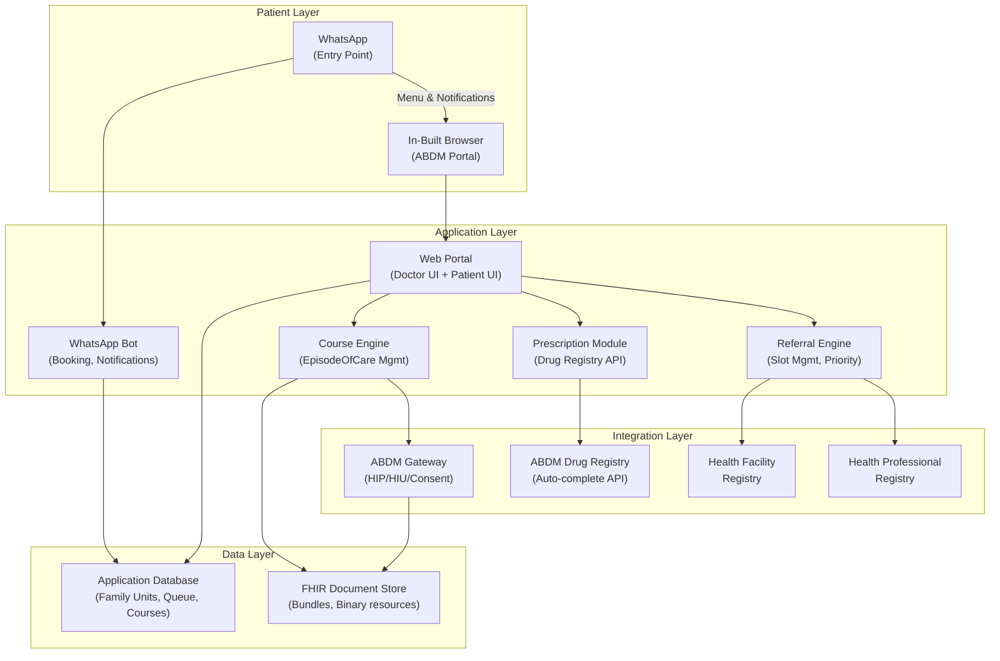

# Project Description — Implementation Specification

## Rural Healthcare Accessibility: Patient Portal & Doctor Portal

---

## 1. Family Booking — How a User Books for Family Members

### 1.1 The ABHA Reality

ABDM does not provide a public API to fetch family members from a single ABHA ID. Each ABHA ID is an individual identifier — there is no hierarchical "family account" in the ABDM architecture. The consumer apps (ABHA app, Aarogya Setu) do allow users to manage family members locally, but this data is not exposed through the developer APIs.

**Our approach:** We maintain our own **Family Unit module** in the application database. The primary user links family members once, and from that point on, they can book appointments, manage consent, and track referrals for any member in their family — all from their own WhatsApp.

### 1.2 Family Linking — How It Works

**First-time setup (one-time):**

When a user first interacts with the system, the WhatsApp bot asks:

```
Bot: Would you like to add family members so you can
     book appointments for them too?

     [1] Yes, add family members
     [2] No, just me for now
```

If the user selects "Yes":

```
Bot: How would you like to add a family member?

     [1] Enter their ABHA ID (if they have one)
     [2] Add without ABHA (for children / elderly without ABHA)
```

**Option 1 — Family member has an ABHA ID:**

The user enters the family member's ABHA number (14-digit). The system calls the ABDM Profile API using that ABHA ID to fetch the member's basic demographics (name, age, gender) — this requires the family member to authenticate via their own OTP once, to confirm consent for linking. After this one-time verification, the member is linked to the primary user's family unit in our database.

**Option 2 — Family member does not have ABHA (children, elderly):**

The user provides basic information manually:

| Field | Required | Notes |
|---|---|---|
| Full Name | Yes | As it would appear on records |
| Date of Birth | Yes | For age calculation, immunization scheduling |
| Gender | Yes | — |
| Relationship to primary user | Yes | Son, Daughter, Spouse, Parent, etc. |
| Mobile number | Optional | May share primary user's number |

The system creates a local patient profile. When this member visits a facility, the facility can create an ABHA ID for them at the point of care (ABDM supports facility-initiated ABHA creation), and the system links it to the existing profile.

### 1.3 Booking for a Family Member

After family linking, every time the user selects "Book Appointment," the bot asks:

```
Bot: Book appointment for:

     [1] Yourself — Ramesh Kumar (M, 45)
     [2] Sunita Kumar — Wife (F, 38)
     [3] Arjun Kumar — Son (M, 12)
     [4] Baby Kumar — Daughter (F, 2)
     [5] + Add new family member
```

The user selects a member, and the booking proceeds under that member's name and profile. The confirmation, queue notifications, and referral cards are all sent to the primary user's WhatsApp (since the primary user is the one managing the family's healthcare).

### 1.4 Data Model — Family Unit

```
Family Unit
├── Primary User (ABHA: 14-XXXX-XXXX-1234)
│   ├── name: "Ramesh Kumar"
│   ├── phone: "9918XXXXXX" (WhatsApp-linked)
│   ├── abha_id: "14-XXXX-XXXX-1234"
│   └── role: HEAD
│
├── Member (ABHA: 14-XXXX-XXXX-5678)
│   ├── name: "Sunita Kumar"
│   ├── relationship: SPOUSE
│   ├── abha_id: "14-XXXX-XXXX-5678"
│   └── linked_via: OTP verification (one-time)
│
├── Member (ABHA: 14-XXXX-XXXX-9012)
│   ├── name: "Arjun Kumar"
│   ├── relationship: SON
│   ├── abha_id: "14-XXXX-XXXX-9012"
│   └── linked_via: OTP verification (one-time)
│
└── Member (No ABHA yet)
    ├── name: "Baby Kumar"
    ├── relationship: DAUGHTER
    ├── dob: "2024-03-15"
    ├── local_id: "FAM-1234-004"
    └── abha_id: null (to be created at facility)
```

---

## 2. Continuity of Care — The "Course" Model

### 2.1 What Continuity Means in This System

Continuity is not just "the next doctor can see the previous doctor's prescription." It means: **when a patient starts a treatment journey for a specific condition, every interaction related to that condition — across multiple doctors, multiple facilities, multiple visits — is grouped together as one continuous case.**

We call this a **Course**.

### 2.2 What a Course Is

A Course is a container that groups all clinical activity related to a single treatment journey. It starts when a doctor begins treatment for a condition and ends when the treatment is complete or the patient is discharged from care.

**Examples of Courses:**

| Course | Starts When | Contains | Ends When |
|---|---|---|---|
| **TB Treatment** | PHC doctor diagnoses TB and starts treatment | Initial diagnosis, sputum test reports, chest X-ray, DOTS prescription, monthly follow-up notes, drug sensitivity reports, specialist referral notes, back-referral notes, final sputum clearance report | Patient completes full DOTS course and is declared cured |
| **Pregnancy (ANC)** | First ANC visit confirms pregnancy | ANC-1 through ANC-4 records, all lab reports (Hb, urine, blood group, HIV, HBsAg), ultrasound reports, IFA/calcium prescriptions, HRP flags, delivery notes, PNC follow-up | 42 days post-delivery (PNC complete) |
| **Hypertension Management** | Doctor diagnoses hypertension | Initial assessment, BP readings over time, lifestyle counseling notes, medication prescriptions, dose adjustments, specialist cardiology referral (if needed), back-referral notes | Ongoing (chronic condition — course stays open) |
| **Fracture Treatment** | Patient arrives at PHC with injury | X-ray report, referral to orthopedic specialist, surgery notes, follow-up X-rays, physiotherapy notes, back-referral to PHC | Bone healed, full mobility restored |

### 2.3 How a Course Is Created

**Step 1: Doctor starts treatment.**

When a doctor writes a diagnosis and prescription for a new condition, the system prompts:

```
┌──────────────────────────────────────────────┐
│  New diagnosis entered: Pulmonary TB          │
│                                               │
│  [Create New Course: "TB Treatment"]          │
│  [Add to Existing Course: ▼ select]           │
│  [No Course — standalone visit]               │
└──────────────────────────────────────────────┘
```

If the doctor selects "Create New Course," a Course is created. From this point, every clinical action the doctor takes for this patient — prescriptions, lab orders, notes, referrals — is filed inside this Course.

**Step 2: Course continues across doctors and facilities.**

When a referred doctor opens this patient's record, they see:

```
┌──────────────────────────────────────────────────────────────┐
│  PATIENT: Ramesh Kumar    ABHA: 14-XXXX-XXXX-1234            │
│                                                               │
│  ACTIVE COURSES                                               │
│  ┌───────────────────────────────────────────────────────┐    │
│  │ 🔴 TB Treatment                                       │    │
│  │    Started: 01-Aug-2026 by Dr. Subhash (PHC Ramnagar) │    │
│  │    Last update: 14-Sep-2026                            │    │
│  │    Status: Active — Month 2 of DOTS                    │    │
│  │    📎 5 documents │ 3 prescriptions │ 1 referral       │    │
│  │    [Open Course]                                       │    │
│  └───────────────────────────────────────────────────────┘    │
│                                                               │
│  PAST COURSES                                                 │
│  ┌───────────────────────────────────────────────────────┐    │
│  │ ✅ Acute Fever (Resolved)                              │    │
│  │    Jul 2025 — Jul 2025. 1 visit. PHC Ramnagar.        │    │
│  └───────────────────────────────────────────────────────┘    │
└──────────────────────────────────────────────────────────────┘
```

**Step 3: Referred doctor opens the Course.**

When the referred doctor clicks "Open Course," they see the **complete case paper** — every note, prescription, report, and referral within this Course, in chronological order:

```
┌────────────────────────────────────────────────────────────────┐
│  COURSE: TB Treatment                                          │
│  Patient: Ramesh Kumar │ Started: 01-Aug-2026                  │
│                                                                │
│  TIMELINE                                                      │
│  ────────────────────────────────────────────────────          │
│                                                                │
│  01-Aug-2026 │ Dr. Subhash, PHC Ramnagar                      │
│  ├─ Diagnosis: Pulmonary TB (sputum +ve)                      │
│  ├─ 📋 Notes: "Patient presents with chronic cough 3 weeks,   │
│  │   evening fever, weight loss 4kg. Sputum AFB positive.     │
│  │   Started on Cat-I DOTS."                                   │
│  ├─ 💊 Rx: HRZE (Isoniazid + Rifampicin + Pyrazinamide       │
│  │       + Ethambutol) — Intensive Phase, 2 months            │
│  └─ 📄 Report: Sputum AFB — Positive (2+)                    │
│                                                                │
│  15-Aug-2026 │ Dr. Subhash, PHC Ramnagar                      │
│  ├─ 📋 Notes: "2-week follow-up. Cough reducing. No adverse   │
│  │   drug reaction. Weight stable. Continue DOTS."            │
│  └─ 📄 Report: Liver Function Test — Normal                   │
│                                                                │
│  01-Sep-2026 │ Dr. Subhash, PHC Ramnagar                      │
│  ├─ 📋 Notes: "1-month follow-up. Sputum repeat ordered.      │
│  │   Patient reports joint pain — possible pyrazinamide side  │
│  │   effect. Referring to chest specialist for opinion."      │
│  ├─ 📄 Report: Sputum AFB — Positive (1+) (reducing)         │
│  └─ 🔄 REFERRAL → Dr. Mehra, Chest Specialist, District Hosp │
│     Priority: 14-day │ Valid until: 15-Sep-2026                │
│                                                                │
│  05-Sep-2026 │ Dr. Mehra, District Hospital                   │
│  ├─ 📋 Notes: "Reviewed case. Sputum reducing as expected.    │
│  │   Joint pain likely pyrazinamide-induced arthralgia.       │
│  │   Advised Uric Acid test. If elevated, consider replacing  │
│  │   Pyrazinamide with Levofloxacin in continuation phase.   │
│  │   Continue current regimen for now."                       │
│  ├─ 📄 Report: Chest X-ray — Bilateral infiltrates (improving)│
│  ├─ 💊 Rx: Tab Uricosuric 100mg 1-0-1 (for joint pain)      │
│  └─ 🔄 BACK-REFERRAL → Dr. Subhash, PHC Ramnagar            │
│     "Continue DOTS. Recheck sputum at 2 months.               │
│      Follow-up with me only if Uric Acid >8 or               │
│      joint pain worsens. Next PHC follow-up: 15-Sep."         │
│                                                                │
│  [+ Add Notes]  [+ Add Prescription]  [+ Upload Report]       │
│  [+ Create Referral from this Course]                          │
└────────────────────────────────────────────────────────────────┘
```

**The key insight:** Dr. Mehra (the specialist) did not need to ask Ramesh a single question about his history. He opened the Course, read Dr. Subhash's notes, saw the sputum reports, understood the timeline, and added his own notes and prescription directly into the same case paper. The case paper grew, not restarted.

When Dr. Subhash receives the back-referral, he opens the same Course and sees Dr. Mehra's notes, the chest X-ray, and the specific follow-up instructions — all in the same timeline. No phone calls. No "what did the specialist say?"

### 2.4 Granular Document Access Per Course — "One-Click Consent"

This solves the problem of: "For TB, the doctor needs 5 specific documents. How does the next doctor get access to all of them at once?"

**How it works:**

When a Course is created, the system defines a **Document Bundle** — the set of record types that are clinically relevant for this type of course. This bundle is pre-configured per condition:

| Course Type | Document Bundle (auto-included) |
|---|---|
| **TB Treatment** | Sputum AFB reports, Chest X-ray, LFT (Liver Function Test), Drug sensitivity test, Treatment prescription history |
| **Pregnancy (ANC)** | Hb reports, Blood group & Rh typing, Urine routine, HIV/HBsAg/VDRL, Ultrasound reports, BP readings, IFA/Calcium prescriptions |
| **Hypertension** | BP trend readings, ECG, Renal function test, Lipid profile, Current medication list |
| **Diabetes** | Fasting blood sugar, HbA1c, Renal function, Retinal screening report, Current medication list |

**When a doctor opens a Course that they've been referred to, the consent request to the patient is bundled:**

```
┌──────────────────────────────────────────────────────┐
│  CONSENT REQUEST                                      │
│                                                       │
│  Dr. Mehra (District Hospital) is requesting access   │
│  to your TB Treatment course.                         │
│                                                       │
│  This includes:                                       │
│  ☑ Sputum AFB reports (2 reports)                     │
│  ☑ Chest X-ray (1 report)                             │
│  ☑ Liver Function Test (1 report)                     │
│  ☑ All prescriptions in this course (2)               │
│  ☑ Dr. Subhash's clinical notes (3 entries)           │
│                                                       │
│  Duration: Until course is closed                     │
│                                                       │
│  [Grant Access to All]     [Review Individually]      │
└──────────────────────────────────────────────────────┘
```

The patient taps **"Grant Access to All"** — one click — and the specialist gets access to every document in the Course. No need to consent to each report separately. No need to know which specific documents the doctor needs. The system knows, because the Course type defines the bundle.

If the patient wants finer control, they can tap "Review Individually" and toggle each document on/off.

### 2.5 FHIR Mapping — How Courses Map to ABDM Standards

The Course model maps directly to standard FHIR R4 resources supported by ABDM:

| Our Concept | FHIR Resource | Role |
|---|---|---|
| **Course** | `EpisodeOfCare` | The container that groups all encounters for this treatment journey |
| **Each doctor visit within a Course** | `Encounter` | Individual visit/consultation, linked to the EpisodeOfCare via the `episodeOfCare` field |
| **Doctor's clinical notes** | `Composition` (OPConsultRecord profile) | The case paper content for each visit |
| **Prescription** | `MedicationRequest` (within PrescriptionRecord bundle) | Drug, dosage, frequency, duration |
| **Lab/diagnostic report** | `DiagnosticReport` + `Observation` (within DiagnosticReportRecord bundle) | Test results with individual parameters |
| **Referral** | `ServiceRequest` | Referral request from one provider to another, linked to the same EpisodeOfCare |
| **Back-referral / follow-up plan** | `CarePlan` | Follow-up instructions from specialist, linked to the same EpisodeOfCare |
| **Uploaded PDF / unstructured document** | `Binary` + `DocumentReference` (HealthDocumentRecord profile) | Base64-encoded file with metadata wrapper |

Every `Encounter` within a Course references the same `EpisodeOfCare` ID. This is what keeps them grouped. When any ABDM-compliant system queries the patient's records, it can filter by EpisodeOfCare to show only the documents relevant to a specific Course.

---

## 3. Two Modes of Adding Documents to a Course

Doctors and facilities add clinical data to a Course in two ways:

### 3.1 Mode 1: Structured Entry (FHIR-native)

The doctor uses the portal's built-in forms to enter data in structured fields. The system converts this into FHIR resources automatically.

**Examples:**

| Clinical Action | Doctor's Interface | FHIR Output |
|---|---|---|
| Write prescription | Auto-complete drug search → select drug → set dosage/frequency/duration → submit | `MedicationRequest` resource inside a `PrescriptionRecord` Bundle |
| Record consultation notes | Free-text notes field with structured fields for chief complaint, examination findings, diagnosis (ICD-10 coded), plan | `Composition` (OPConsultRecord) with structured sections |
| Enter lab results | Structured form: test name (LOINC coded) → value → unit → reference range → interpretation | `DiagnosticReport` + `Observation` resources inside a `DiagnosticReportRecord` Bundle |
| Create referral | Select specialist → set priority → add reason → submit | `ServiceRequest` resource with reason, priority, and linked EpisodeOfCare |

**Advantage:** Structured data is searchable, codified (SNOMED CT, ICD-10, LOINC), and machine-readable. It enables features like auto-alerts, trend analysis, and interoperability across systems.

### 3.2 Mode 2: Direct PDF/Document Upload

For situations where structured entry isn't practical — historical records, external lab reports on paper, specialist letters from non-digital facilities — the doctor or patient can upload a PDF or image directly.

**How it works technically:**

1. Doctor clicks "Upload Report" in the Course view
2. Selects a file (PDF, JPG, PNG) from their device
3. The system:
   - **Base64-encodes** the file content
   - Wraps it in a FHIR `Binary` resource (with `contentType: application/pdf` or `image/jpeg`)
   - Creates a `DocumentReference` resource that provides metadata:
     - Document type (e.g., "Chest X-ray", "Lab Report", "Referral Letter")
     - Date created
     - Author (uploading doctor/facility)
     - Link to the Binary resource
   - The `DocumentReference` is wrapped in a `HealthDocumentRecord` Composition
   - The entire structure is linked to the Course's `EpisodeOfCare`
4. The uploaded document appears in the Course timeline alongside structured entries

**Upload interface:**

```
┌──────────────────────────────────────────────────┐
│  UPLOAD DOCUMENT                                  │
│                                                   │
│  Course: TB Treatment                             │
│                                                   │
│  Document Type: [▼ Select]                        │
│    → Chest X-ray                                  │
│    → Lab Report                                   │
│    → Specialist Letter                            │
│    → Discharge Summary                            │
│    → Prescription (scanned)                       │
│    → Other                                        │
│                                                   │
│  Date of Document: [DD-MM-YYYY]                   │
│                                                   │
│  File: [Choose File] or [Take Photo 📸]           │
│                                                   │
│  Notes (optional): ________________________       │
│                                                   │
│  [Upload & Add to Course]                         │
└──────────────────────────────────────────────────┘
```

**Both modes coexist.** A Course timeline can contain structured prescriptions alongside uploaded PDF reports alongside typed clinical notes. They all appear in chronological order in the same case paper view.

---

## 4. Referral System — Priority Tiers Based on Severity

### 4.1 How the Doctor Sets Referral Priority

When a doctor creates a referral, they select a **priority tier** based on clinical severity. The system does not auto-assign priority — the treating doctor makes this clinical judgment.

**Referral creation interface:**

```
┌──────────────────────────────────────────────────────────────┐
│  CREATE REFERRAL                                              │
│                                                               │
│  Patient: Ramesh Kumar │ Course: TB Treatment                 │
│                                                               │
│  Refer to:                                                    │
│  Department: [▼ Chest & Pulmonology]                          │
│  Location:   [▼ Within 50 km]                                 │
│  Available:  Dr. Mehra, District Hospital — 2 slots free      │
│              Dr. Singh, Medical College — 1 slot free         │
│                                                               │
│  Selected: Dr. Mehra, District Hospital                       │
│                                                               │
│  Reason for Referral: [Suspected drug-induced arthralgia.     │
│  Need specialist opinion on regimen modification.]            │
│                                                               │
│  PRIORITY (select one):                                       │
│  ┌────────────────────────────────────────────────────────┐   │
│  │ 🔴 URGENT — 7-day referral card                        │   │
│  │    For: Conditions requiring specialist attention       │   │
│  │    within one week. Acute complications,                │   │
│  │    deteriorating conditions, diagnostic urgency.        │   │
│  │                                                         │   │
│  │ 🟡 SEMI-URGENT — 14-day referral card                  │   │
│  │    For: Conditions that need specialist review but      │   │
│  │    are clinically stable. Drug side effects,            │   │
│  │    non-emergency opinion, elective procedures.          │   │
│  │                                                         │   │
│  │ 🟢 ROUTINE — 30-day referral card                      │   │
│  │    For: Planned specialist consultations. Chronic       │   │
│  │    disease review, periodic specialist assessment,      │   │
│  │    second opinion for stable conditions.                │   │
│  └────────────────────────────────────────────────────────┘   │
│                                                               │
│  Attach existing Course documents: [☑ Yes, all]               │
│                                                               │
│  [Issue Referral]                                             │
└──────────────────────────────────────────────────────────────┘
```

### 4.2 Priority Tier Details

| Tier | Validity | Reserved Slot Type | Patient Experience | Clinical Indication |
|---|---|---|---|---|
| 🔴 **Urgent (7 days)** | Valid for 7 days from issue date | Reserved from the specialist's "urgent referral" pool | Patient walks in → scanned at priority counter → seen within 30 minutes of arrival | Acute complications, worsening condition, suspected drug reactions, diagnostic urgency, high-risk pregnancy, suspected malignancy |
| 🟡 **Semi-Urgent (14 days)** | Valid for 14 days from issue date | Reserved from the specialist's "referral" pool | Patient walks in or books a specific date within the 14-day window → seen before general walk-ins | Side effects needing specialist opinion, elective procedures, non-emergency diagnostic confirmation, condition stable but needs higher-level assessment |
| 🟢 **Routine (30 days)** | Valid for 30 days from issue date | General referral pool | Patient books a specific date within the 30-day window → priority over walk-ins on that date | Chronic disease periodic review, planned second opinion, health screening follow-up, specialist assessment for stable conditions |

### 4.3 What the Patient Receives (WhatsApp)

```
📋 REFERRAL CARD

Patient: Ramesh Kumar
ABHA: 14-XXXX-XXXX-1234

Referred by: Dr. Subhash, PHC Ramnagar
Referred to: Dr. Mehra, Chest & Pulmonology
             District Hospital, Siddharthnagar

Priority: 🟡 Semi-Urgent
Valid: 01-Sep-2026 to 15-Sep-2026 (14 days)

Reason: Specialist opinion for suspected
        drug-induced arthralgia during TB treatment

Instructions: Visit the Priority Referral Counter
at District Hospital. Show this QR code.
No general registration needed.

[QR CODE]

To book a specific date within this window:
→ Reply "BOOK" to choose a date
→ Or walk in any day before 15-Sep
```

### 4.4 Referral Slot Management at Receiving Hospital

Each government hospital that participates in the system designates a quota of OPD slots specifically for referred patients. These are separate from the general walk-in pool.

| Slot Type | Managed By | Visibility |
|---|---|---|
| **General OPD** | Hospital administration | Available to all walk-in and pre-booked patients |
| **Referral Quota — Urgent** | Department head | Visible only to referring doctors when creating 🔴 urgent referrals. Auto-reserved when referral is issued. |
| **Referral Quota — Standard** | Department head | Visible to referring doctors when creating 🟡 semi-urgent or 🟢 routine referrals. Booked or reserved when referral is issued. |

If no referral slots are available, the system shows this to the referring doctor, who can either choose a different specialist/facility or override with a text-based referral (which will not carry priority status at the receiving hospital).

---

## 5. E-Prescription Auto-Complete — Where the Data Comes From

### 5.1 Primary Data Source: ABDM Drug Registry

The ABDM Drug Registry was launched on **29 June 2026** by the Union Health Ministry. It is the official, government-mandated single source of truth for drug data in India.

| Attribute | Details |
|---|---|
| **Branded drugs** | 123,000+ entries |
| **Generic clinical drugs** | 10,000+ entries |
| **Substances** | 29,000+ entries |
| **Coding standard** | SNOMED CT (international standard for clinical terminology) |
| **Purpose** | Standardize drug identification across all ABDM-compliant systems |
| **Access** | Open APIs via the ABDM developer portal |

**How auto-complete uses it:**

When the doctor types in the prescription field, the system queries the Drug Registry API:

```
Doctor types: "amox"

API returns:
┌──────────────────────────────────────────────────────────────┐
│ 🔍 Results from ABDM Drug Registry                           │
│                                                               │
│  GENERIC                                                      │
│  ├─ Amoxicillin 250mg Capsule                                │
│  ├─ Amoxicillin 500mg Capsule                                │
│  ├─ Amoxicillin 125mg/5ml Suspension (dry powder)            │
│  ├─ Amoxicillin + Clavulanic Acid 625mg Tablet               │
│  └─ Amoxicillin + Clavulanic Acid 228.5mg/5ml Suspension    │
│                                                               │
│  BRANDED (if enabled)                                         │
│  ├─ Mox 500 (Amoxicillin 500mg) — Cipla                     │
│  ├─ Amoxyclav 625 (Amox + Clav 625mg) — Alkem               │
│  └─ Novamox 250 (Amoxicillin 250mg) — Cipla                 │
└──────────────────────────────────────────────────────────────┘
```

When the doctor selects a drug, the system auto-fills:

| Field | Auto-filled Value | Doctor Can Override? |
|---|---|---|
| Drug name (generic) | Amoxicillin 500mg Capsule | No (standardized) |
| SNOMED CT code | Auto-attached (invisible to doctor) | No |
| Dosage | 1-0-1 (default for this drug) | Yes |
| Frequency | Twice daily | Yes |
| Duration | 5 days (default for common infections) | Yes |
| Route | Oral | Yes |
| Instructions | After food | Yes |

### 5.2 Fallback & Supplementary Sources

| Source | Role | When Used |
|---|---|---|
| **ABDM Drug Registry** | Primary — all drug searches query this first | Always |
| **NLEM 2022 (National List of Essential Medicines)** | Flagging — drugs on NLEM are marked with a ⭐ to indicate they should be available at PHCs | When the doctor is prescribing at a PHC, the system suggests NLEM drugs first |
| **Local facility formulary** | Supplementary — each hospital can add locally stocked drugs to their formulary | When a hospital has specific brands or formulations in stock |
| **WHO Essential Medicines List** | Reference — for cross-checking international recommendations | For edge cases not covered by the Drug Registry |

### 5.3 Dosage Templates

For the most common conditions seen at PHC level, the system provides one-click dosage templates. These are curated based on national treatment guidelines (NTEP for TB, MoHFW protocols for ANC, NPCDCS for NCDs):

```
Doctor selects diagnosis: "Iron Deficiency Anemia"

System suggests:
┌──────────────────────────────────────────────────────┐
│  📋 TEMPLATE: Iron Deficiency Anemia (Standard)       │
│                                                       │
│  1. Tab IFA (100mg Iron + 500mcg Folic Acid)         │
│     Dosage: 1-0-0 │ Duration: 90 days │ After food    │
│                                                       │
│  2. Tab Albendazole 400mg                             │
│     Dosage: Single dose │ Empty stomach               │
│                                                       │
│  [Apply Template]  [Modify & Apply]  [Skip]           │
└──────────────────────────────────────────────────────┘
```

Templates speed up the prescription process from 2–3 minutes of typing to a single click. The doctor can modify any field before applying.

---

## 6. Doctor Portal — Minimalist UI Design

### 6.1 Design Philosophy

The doctor's interface must be **dead simple.** Government PHC doctors see 40–80 patients per day. They do not have time to learn complex software, navigate multiple tabs, or interpret color-coded dashboards. Every additional UI element is a reason for them to go back to paper.

**Design rules:**

1. **One screen, one purpose.** The doctor should never need more than one screen to handle the current patient.
2. **No color-coded queue segments visible to the doctor.** The system handles segmentation (referral priority, pre-booked, walk-in) internally. The doctor sees one queue — in the order the system has already sorted. They just tap "Next."
3. **All actions are inline.** Prescribe, refer, add notes, upload — everything happens within the current patient's card. No navigation to separate pages.
4. **Show less, reveal on demand.** Past history, referral chain, and Course documents are behind a single tap. They're not displayed by default.

### 6.2 The Doctor's Main Screen

When the doctor logs in, they see exactly this:

```
┌──────────────────────────────────────────────────────────────┐
│  Dr. Subhash │ PHC Ramnagar │ 16-Sep-2026                    │
│  Patients today: 34 │ Completed: 12 │ Remaining: 22          │
│                                                               │
│  ═══════════════════════════════════════════════              │
│                                                               │
│  CURRENT PATIENT                                              │
│  ┌────────────────────────────────────────────────────────┐   │
│  │  #13 │ Ramesh Kumar │ M, 45 │ ABHA Linked ✓           │   │
│  │  Booked via: WhatsApp │ Complaint: Follow-up TB         │   │
│  │                                                         │   │
│  │  [Courses ▸]  [Full History ▸]  [Referrals ▸]          │   │
│  │                                                         │   │
│  │  ─── Quick Actions ─────────────────────────           │   │
│  │  [📝 Notes]  [💊 Prescribe]  [📄 Upload]  [🔄 Refer]  │   │
│  │                                                         │   │
│  │                                 [✓ Complete & Next]     │   │
│  └────────────────────────────────────────────────────────┘   │
│                                                               │
│  NEXT UP                                                      │
│  ┌────────────────────────────────────────────────────────┐   │
│  │  #14 │ Sunita Devi │ F, 32 │ Complaint: Headache       │   │
│  └────────────────────────────────────────────────────────┘   │
│  ┌────────────────────────────────────────────────────────┐   │
│  │  #15 │ Meera Singh │ F, 28 │ Complaint: ANC checkup    │   │
│  └────────────────────────────────────────────────────────┘   │
└──────────────────────────────────────────────────────────────┘
```

**What the doctor sees by default:** Patient name, age, gender, what they're here for, and four action buttons. That's it.

**What the doctor sees on demand (one tap):**

- **[Courses ▸]** — Opens the list of active and past Courses for this patient. Doctor selects a Course to see the full case paper timeline (as described in Section 2.3).
- **[Full History ▸]** — Shows all past visits across all facilities, not grouped by Course. Useful for getting a broad overview.
- **[Referrals ▸]** — Shows the complete referral chain for this patient.

### 6.3 Referral History — One Button, Full Chain

When the doctor taps **[Referrals ▸]**, the system shows the complete referral history for this patient as a chain:

```
┌──────────────────────────────────────────────────────────────┐
│  REFERRAL HISTORY — Ramesh Kumar                              │
│                                                               │
│  TB Treatment Course                                          │
│  ────────────────                                             │
│  01-Sep-2026                                                  │
│  PHC Ramnagar (Dr. Subhash)                                  │
│    → Referred to: District Hospital (Dr. Mehra)               │
│    → Priority: 🟡 Semi-Urgent (14-day)                       │
│    → Reason: Suspected drug-induced arthralgia                │
│    → Status: ✅ Patient visited on 05-Sep                     │
│                                                               │
│  05-Sep-2026                                                  │
│  District Hospital (Dr. Mehra)                                │
│    → BACK-REFERRAL to: PHC Ramnagar (Dr. Subhash)            │
│    → Instructions: "Continue DOTS. Recheck sputum at          │
│      2 months. Follow-up only if Uric Acid >8."              │
│    → Follow-up booked: 15-Sep-2026 at PHC Ramnagar           │
│    → Status: ✅ Follow-up completed                           │
│                                                               │
│  No further referrals.                                        │
└──────────────────────────────────────────────────────────────┘
```

**If the doctor refers to the same previous doctor** (e.g., Dr. Subhash refers back to Dr. Mehra for a second opinion), the system recognizes this and displays the back-referral context automatically:

```
┌──────────────────────────────────────────────────────────────┐
│  ℹ️ This patient was previously referred to Dr. Mehra on      │
│  01-Sep-2026 for the same Course (TB Treatment).              │
│                                                               │
│  Dr. Mehra's previous notes:                                  │
│  "Joint pain likely pyrazinamide-induced arthralgia.          │
│   Advised Uric Acid test. If elevated, consider replacing     │
│   Pyrazinamide with Levofloxacin in continuation phase."      │
│                                                               │
│  [Proceed with New Referral]   [Cancel]                       │
└──────────────────────────────────────────────────────────────┘
```

This prevents duplicate referrals and gives the doctor immediate context about the prior interaction — without navigating anywhere. The system surfaces it automatically.

### 6.4 The "Complete & Next" Flow

When the doctor taps **[✓ Complete & Next]**:

1. All notes, prescriptions, reports, and referrals entered during this consultation are finalized
2. Prescription is digitally signed and pushed to ABDM
3. Patient receives WhatsApp notification with prescription link
4. If a referral was created, patient receives the referral card
5. The queue advances — next patient's card slides into the "CURRENT PATIENT" position
6. The completed patient disappears from view

The doctor's entire workflow is: **Read → Act → Complete → Next.** No navigation. No page changes. No dashboards to check.

---

## 7. Appointment Booking — Complete Flow

### 7.1 Patient-Side Flow (WhatsApp)

```
Step 1: Patient sends "Hi" to the system's WhatsApp number

Bot:  Namaste! 🏥
      Book appointment for:
      [1] Yourself — Ramesh Kumar
      [2] Sunita Kumar (Wife)
      [3] Arjun Kumar (Son)
      [4] + Add family member

──────────────────────────────────────

Step 2: Patient selects [1] (Yourself)

Bot:  Select department:
      [1] General OPD
      [2] Maternal & Child Health
      [3] Dental
      [4] Eye
      [5] Ayush

──────────────────────────────────────

Step 3: Patient selects [1] (General OPD)

Bot:  📍 Share your location or enter your area:
      [1] Share location (tap to send)
      [2] Type area name

──────────────────────────────────────

Step 4: Patient shares location or types "Ramnagar"

Bot:  Nearby government hospitals with General OPD:

      [1] PHC Ramnagar — 3 km
          Dr. Subhash │ Available: 18 slots │ Mon-Sat
      [2] CHC Bansi — 12 km
          Dr. Gupta │ Available: 24 slots │ Mon-Sat
      [3] District Hospital Siddharthnagar — 28 km
          Multiple doctors │ Available: 40+ slots │ Daily

──────────────────────────────────────

Step 5: Patient selects [1] (PHC Ramnagar)

Bot:  Available dates for PHC Ramnagar (General OPD):

      [1] Tomorrow, 17-Sep (Wed) — 18 slots
      [2] 18-Sep (Thu) — 22 slots
      [3] 19-Sep (Fri) — 15 slots
      [4] 20-Sep (Sat) — 20 slots

──────────────────────────────────────

Step 6: Patient selects [1] (Tomorrow)

Bot:  ✅ APPOINTMENT CONFIRMED

      Patient: Ramesh Kumar
      Hospital: PHC Ramnagar
      Department: General OPD
      Doctor: Dr. Subhash
      Date: 17-Sep-2026 (Wednesday)
      Token: #7
      Estimated time: 10:15 AM

      📱 Show this QR code at reception:
      [QR CODE]

      To cancel, reply CANCEL
      To reschedule, reply RESCHEDULE
```

### 7.2 Where Patient Info Comes From

The system does **not** ask the patient to fill out forms. Patient information is sourced in this priority order:

| Source | What It Provides | When Used |
|---|---|---|
| **ABHA Profile (via ABDM API)** | Name, DOB, gender, address, phone, ABHA ID, photo | If the patient has linked their ABHA during initial setup. This is the primary source. The system auto-fetches demographics — no manual entry. |
| **Family Unit database** | Name, DOB, gender, relationship, phone | For family members added without ABHA (Option 2 in Section 1.2). The system uses locally stored data. |
| **Manual entry (first-time only)** | Name, age, gender, phone | Only if the patient has neither ABHA nor a local profile. This data is collected once and stored for future bookings. |

### 7.3 Hospital Data Source

The list of government hospitals, their departments, doctors, and slot availability comes from:

| Data | Source |
|---|---|
| **Hospital list** | Health Facility Registry (HFR) — the official ABDM registry of all healthcare facilities in India. Filtered for government facilities. |
| **Departments available** | Configured by each facility's admin when they register on the system |
| **Doctor list** | Health Professional Registry (HPR) — the official ABDM registry of all healthcare professionals. Cross-referenced with facility assignments. |
| **Slot availability** | Managed in real-time by the system's queue management module. Each doctor/department has a configurable daily capacity. |
| **Location/distance** | Calculated from the patient's shared GPS coordinates or entered location against the facility's coordinates in HFR |

### 7.4 What Happens at the Hospital Side

When a patient books via WhatsApp, the hospital's system immediately:

1. Creates a queue entry for that patient on the selected date
2. Decrements the available slot count for that doctor/date
3. Pre-populates the patient's basic info (from ABHA or local profile) so the reception desk doesn't need to do manual registration
4. When the patient arrives and scans their QR at reception, the system marks them as "Arrived" and inserts them into the live queue at their token position

---

## 8. Technical Architecture Summary



### Key Integration Points

| Integration | Protocol | Purpose |
|---|---|---|
| **ABDM Gateway** | REST API (ABDM Sandbox → Production) | HIP (publish records), HIU (fetch records), Consent Manager (manage consent artifacts) |
| **ABDM Drug Registry** | REST API | Drug search, auto-complete, SNOMED CT code resolution |
| **Health Facility Registry** | REST API | Hospital search by location, department, capacity |
| **Health Professional Registry** | REST API | Doctor verification, specialty lookup |
| **WhatsApp Business API** | REST API (Meta Cloud API or BSP) | Send/receive messages, interactive menus, notifications |
| **ABHA Profile API** | REST API (ABDM V3) | Fetch patient demographics, verify ABHA identity |

---

## 9. Data Privacy & Compliance

| Concern | Implementation |
|---|---|
| **Patient data on WhatsApp** | WhatsApp is used only for menus, confirmations, and links. No clinical data (prescriptions, reports, diagnosis) is transmitted as chat text. All clinical interactions happen within the ABDM-compliant web portal. |
| **Consent for data sharing** | Every data access between providers goes through the ABDM Consent Manager. Consent artifacts are cryptographically signed, time-limited, and revocable. |
| **DPDP Act 2023 compliance** | Purpose limitation (data used only for stated clinical purpose), data minimization (only relevant records shared per Course bundle), right to erasure, audit trail for all access events. |
| **Data at rest** | Application database and FHIR document store encrypted at rest (AES-256). |
| **Data in transit** | All API calls over HTTPS/TLS 1.3. ABDM mandates encrypted health record exchange between HIP and HIU. |
| **Doctor authentication** | HPR-verified credentials. Session-based access with timeout. |
| **Patient authentication** | ABHA-based authentication via mobile OTP or Aadhaar OTP through the ABDM identity layer. |
